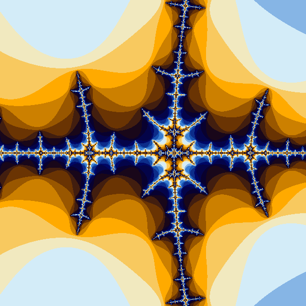
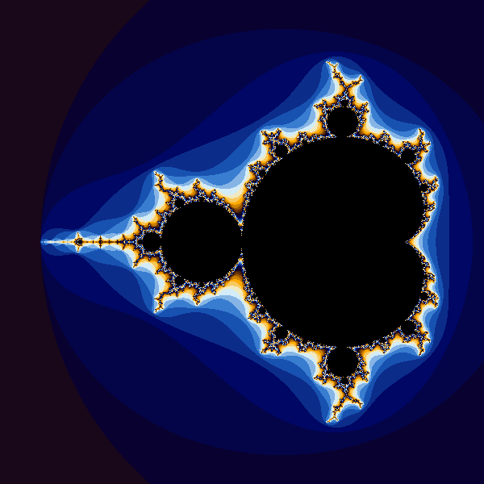
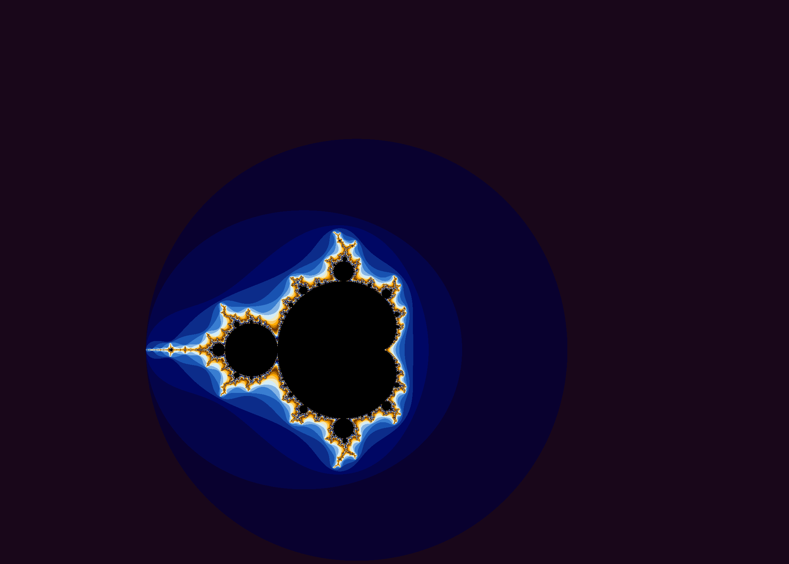

# Rust-Mandelbrot

A simple Mandelbrot fractal generator written in Rust

## installation

- Install Rust
- git clone repo
- cargo run
- admire a fractal

# Usage:

-> Adjusting the number of frames:

- To adjust the number of frames generated, go to src/constants.rs and edit the START_ZOOM and END_ZOOM consts

# Warning

- if you keep the default values in the src/constants.rs file, it might take a while to generate the fractal gif
